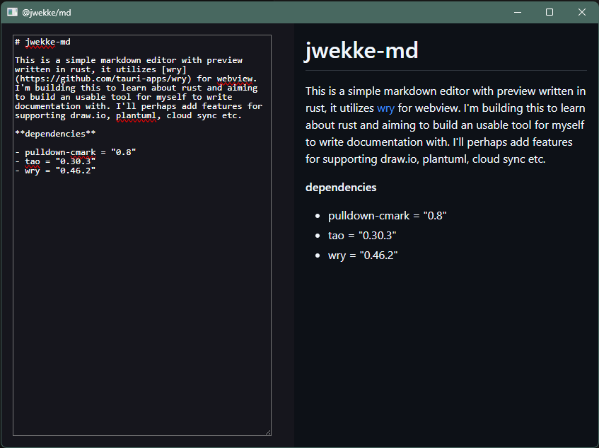

# jwekke-md

This is a simple markdown editor with preview written in rust, it utilizes [wry](https://github.com/tauri-apps/wry) for webview. I'm building this to learn about rust and aiming to build an usable tool for myself to write documentation with. I'll perhaps add features for supporting draw.io, plantuml, cloud sync etc.

**dependencies**

- pulldown-cmark = "0.8"
- tao = "0.30.3"
- wry = "0.46.2"
